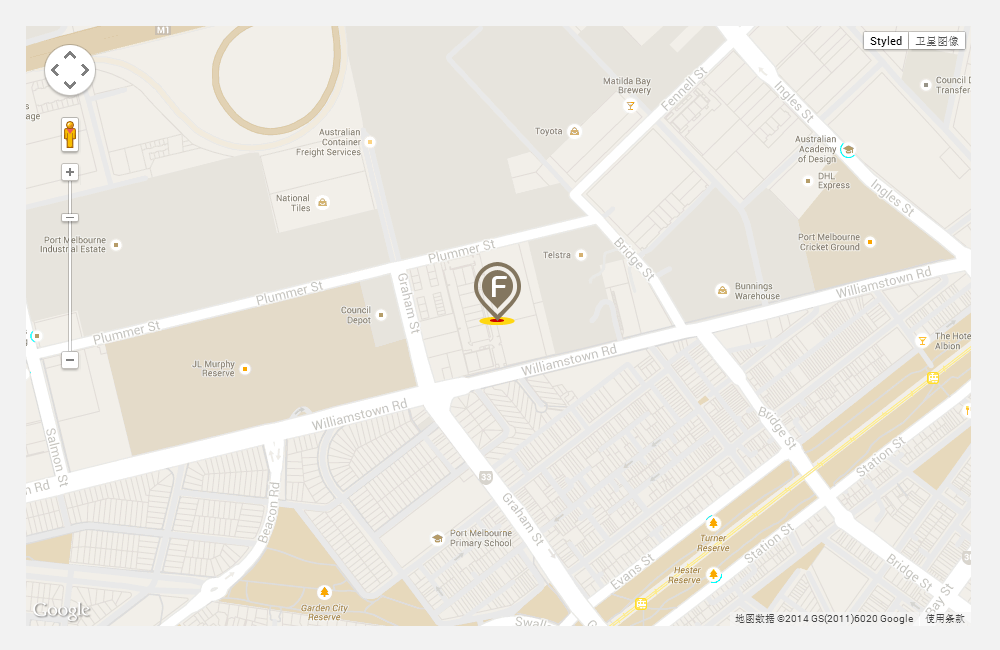

Google Maps v3
===========

[Live sample](http://zhongsp.github.io/google-maps)

Custom Google Maps.

# Get started

```bash
$ npm install
```

# Versions

1. Google Maps API v3 - index.html

1. Angular google maps - index-ng.html

# Features

* Marker
* Style

## Screenshot


